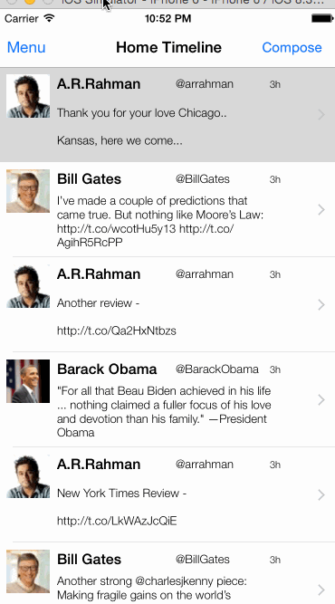

This is a basic twitter app to read and compose tweets the [Twitter API](https://apps.twitter.com/).

Time spent: 10 hours

### Features

#### Required
- [X] Dragging anywhere in the view should reveal the menu.
- [X] The menu should include links to your profile, the home timeline, and the mentions view.
- [X] Contains the user header view
- [X] Contains a section with the users basic stats: # tweets, # following, # followers
- [X] Tapping on a user image should bring up that user's profile page

### Walkthrough

